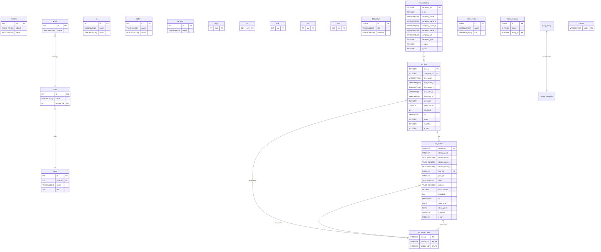

```mermaid
erDiagram

nations {
    INT id PK
    VARCHAR(32) offical
    VARCHAR(32) short
}

prefs {
    INT id PK
    VARCHAR(16) name
}

stores {
    INT id PK
    VARCHAR(32) name
    INT hq_pref_id FK
}
prefs }o--|| stores : belongs

foods {
    INT id PK
    INT store_id FK
    VARCHAR(64) name
    INT yen
}
stores }o--|| foods : sells

os {
    INT id PK
    VARCHAR(32) name
    VARCHAR(128) emoji
}

editors {
    INT id PK
    VARCHAR(32) name
    VARCHAR(128) emoji
}

persons {
    INT id PK
    VARCHAR(32) name
}

digits {
    INT digit PK
}

u8 {
    INT val PK
}

u16 {
    INT val PK
}

i8 {
    INT val PK
}

i16 {
    INT val PK
}

bot_detail {
    SERIAL id PK
    VARCHAR(32) title
    VARCHAR(256) contents
}

eki_company {
    INTEGER company_cd PK
    INTEGER rr_cd
    VARCHAR(256) company_name
    VARCHAR(256) company_name_k
    VARCHAR(256) company_name_h
    VARCHAR(256) company_name_r
    VARCHAR(512) company_url
    INTEGER company_type
    INTEGER e_status
    INTEGER e_sort
}

eki_line {
    INTEGER line_cd PK
    INTEGER company_cd FK
    VARCHAR(256) line_name
    VARCHAR(256) line_name_k
    VARCHAR(256) line_name_h
    VARCHAR(8) line_color_c
    VARCHAR(32) line_color_t
    INTEGER line_type
    DOUBLE PRECISION lon
    DOUBLE PRECISION lat
    INTEGER zoom
    INTEGER e_status
    INTEGER e_sort
}

eki_company ||--|{ eki_line : has

eki_station {
    INTEGER station_cd PK
    INTEGER station_g_cd
    VARCHAR(256) station_name
    VARCHAR(256) station_name_k
    VARCHAR(256) station_name_r
    INTEGER line_cd FK
    INTEGER pref_cd
    VARCHAR(32) post
    VARCHAR(1024) address
    DOUBLE PRECISION lon
    DOUBLE PRECISION lat
    DATE open_ymd
    DATE close_ymd
    INTEGER e_status
    INTEGER e_sort
}

eki_line ||--|{ eki_station : has

eki_station_join {
    INTEGER line_cd PK
    INTEGER station_cd1 PK,FK
    INTEGER station_cd2 PK,FK
}

eki_line }|--|| eki_station_join : associative
eki_station }|--|| eki_station_join : associative
eki_station }|--|| eki_station_join : associative

msky_emoji {
    SERIAL id PK
    VARCHAR(128) name
    VARCHAR(1024) info
}

msky_hiragana {
    SERIAL id PK
    CHAR(1) kana
    INTEGER emoji_id FK
}

misky_emoji ||--|| misky_hiragana : corresponds

puppu {
    VARCHAR(32) code PK
}

```
