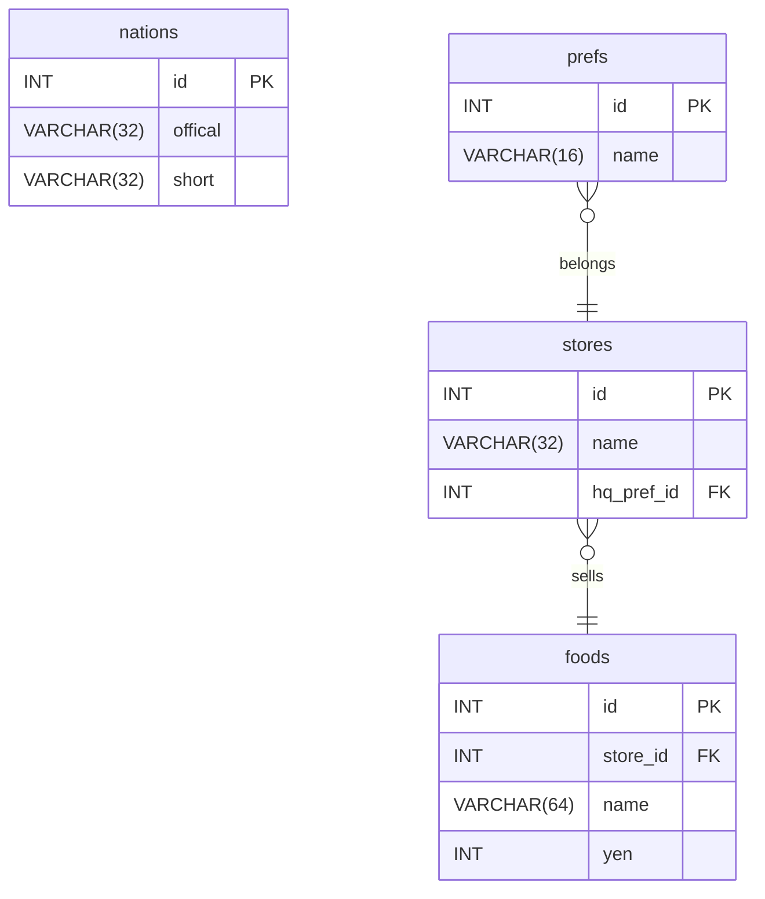

```mermaid
erDiagram

nations {
    INT id PK
    VARCHAR(32) offical
    VARCHAR(32) short
}

prefs {
    INT id PK
    VARCHAR(16) name
}

stores {
    INT id PK
    VARCHAR(32) name
    INT hq_pref_id FK
}
prefs }o--|| stores : belongs

foods {
    INT id PK
    INT store_id FK
    VARCHAR(64) name
    INT yen
}
stores }o--|| foods : sells

```
